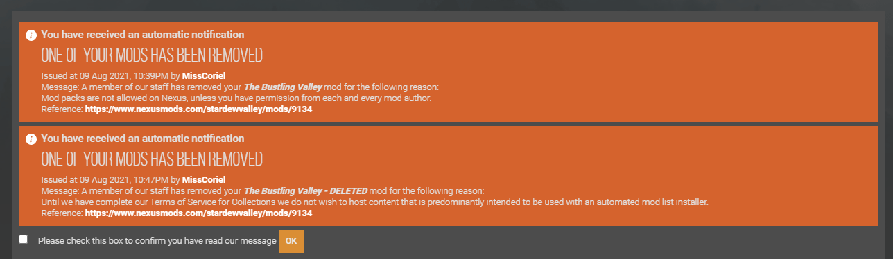
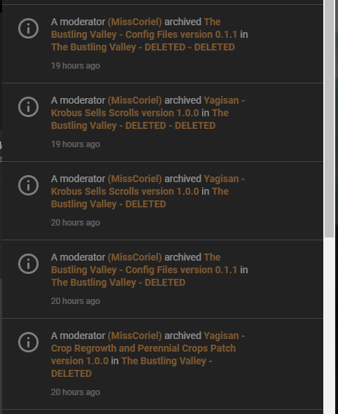

# Changelog

- [Changelog](#changelog)
  - [Semantic Versioning](#semantic-versioning)
  - [0.1.5](#015)
  - [0.1.4](#014)
  - [0.1.3](#013)
  - [0.1.2](#012)
  - [0.1.1](#011)
  - [0.1.0](#010)

## Semantic Versioning

This modlist uses semantic versioning, where given a version number MAJOR.MINOR.PATCH, increment the:

1. MAJOR version when you make incompatible mod list changes. **a new game is required**
2. MINOR version when you add functionality in a backwards compatible manner, **a new game is recommended**
3. PATCH version when you make backwards compatible bug fixes.

**Major version zero (0.y.z) is for initial development. Anything MAY change at any time.** Read more about [Semantic Versioning here](https://semver.org/).

Due to the nature of some of the larger mods included in this mod list, a MAJOR update may be required when updating. If that is the case, consider finishing your current game before updating.

## 0.1.5

**Released:** `DD MM YYYY`

### Info <!-- omit in toc -->

**This is a pre-release of The Bustling Valley. It is subject to change, and should not be used for a non-testing playthrough.**

### Additions <!-- omit in toc -->

**[Stardew Auto GC](https://www.nexusmods.com/stardewvalley/mods/9293)** automatically triggers memory garbage collection at the end of each day. This does not eliminate OOM errors, but does help reduce excessive memory usage.

### Updates <!-- omit in toc -->

**[The Love of Cooking](https://www.nexusmods.com/stardewvalley/mods/6830)**  updated to 1.0.20

**[Yagisan's Bountiful Valley](https://www.nexusmods.com/stardewvalley/mods/9259)** updated to 1.0.1

**[Ridgeside Village](https://www.nexusmods.com/stardewvalley/mods/7286)** updated to 1.2.14

## 0.1.4

**Released:** `14 Aug 2021`

### Info <!-- omit in toc -->

**This is a pre-release of The Bustling Valley. It is subject to change, and should not be used for a non-testing playthrough.**

**A NEW farm is required. Stardew Valley Expanded was removed and all maps have changed as a result.**

### Additions <!-- omit in toc -->

**[Yagisan's Bountiful Valley](https://www.nexusmods.com/stardewvalley/mods/9259)** The valley will have a much larger selection of forage based on weather, location and date.

**[Yagisan's Bountiful Valley for Boarding House](https://www.nexusmods.com/stardewvalley/mods/9263)**

**[Yagisan's Bountiful Valley for Ridgeside Village](https://www.nexusmods.com/stardewvalley/mods/9272)**

**[The Ranch Expansion Marnie and Jas](https://www.nexusmods.com/stardewvalley/mods/5070)**

**[Mister Ginger](https://www.nexusmods.com/stardewvalley/mods/5295)**

**[Community Center Reimagined](https://www.nexusmods.com/stardewvalley/mods/6966)**

**[A Cleaner Sewer](https://www.nexusmods.com/stardewvalley/mods/5751)**

**[Egg Festival Winner Randomized](https://www.nexusmods.com/stardewvalley/mods/8574)**

**[Fishing Assistant](https://www.nexusmods.com/stardewvalley/mods/5815)**

### Updates <!-- omit in toc -->

**[Better Junimos](https://www.nexusmods.com/stardewvalley/mods/2221)** updated to 2.0.0-beta8

**[Better Junimos Forestry](https://www.nexusmods.com/stardewvalley/mods/8992)** updated to 1.0.3

**[Juliet and Jessie the Joja Clerks](https://www.nexusmods.com/stardewvalley/mods/6398)** rollback to 1.0.6

### Removed <!-- omit in toc -->

**[Stardew Valley Expanded](https://www.nexusmods.com/stardewvalley/mods/3753)**

**[Seasonal Outfits - Slightly Cuter Aesthetic for SVE](https://www.nexusmods.com/stardewvalley/mods/5969)**

**[Social Page Order Button](https://www.nexusmods.com/stardewvalley/mods/7871)**

## 0.1.3

**Released:** `9 Aug 2021`

### Info <!-- omit in toc -->

**This is a required update.**

**Broken download links fixed.**

On 9 Aug 2021, Nexus decided that the configuration files, and all my own supporting mod files, violated a non-existent part of their terms and conditions. It was especially odd considering that they just forced all mod authors remaining on Nexus to accept being included in mod packs as of 5 Aug 2021. **So they deleted them.**

## 0.1.2

**Released:** `9 Aug 2021`

### Info <!-- omit in toc -->

**This is a pre-release of The Bustling Valley. It is subject to change, and should not be used for a non-testing playthrough.**

### Additions <!-- omit in toc -->

**[Yagisan's - Krobus Sells Scrolls](https://www.nexusmods.com/stardewvalley/mods/9248)** Krobus will now sell random dwarf scrolls after reaching 4 hearts.

**[Statue of Generosity](https://www.nexusmods.com/stardewvalley/mods/7532)**

**[Luck Skill](https://www.nexusmods.com/stardewvalley/mods/521)**

### Updates <!-- omit in toc -->

**[Custom NPCs for NPC Map Locations](https://www.nexusmods.com/stardewvalley/mods/8174)** updated to 1.1.8

**[Horse Flute Anywhere](https://www.nexusmods.com/stardewvalley/mods/7500)** updated to 1.1.7

**[SpaceCore](https://www.nexusmods.com/stardewvalley/mods/1348)** updated to 1.5.10

**[JSON Assets](https://www.nexusmods.com/stardewvalley/mods/1720)** updated to 1.8.3

**[Capstone Professions](https://www.nexusmods.com/stardewvalley/mods/7636)** updated to 1.0.4

**[Bigger Craftables](https://www.nexusmods.com/stardewvalley/mods/7530)** updated to 1.1.1

**[More Giant Crops](https://www.nexusmods.com/stardewvalley/mods/5263)** updated to 1.0.2

**[Automatic Gates](https://www.nexusmods.com/stardewvalley/mods/3109)** updated to 2.5.2

**[Juliet and Jessie the Joja Clerks](https://www.nexusmods.com/stardewvalley/mods/6398)** updated to Discord release 27 Jul 2021

**[Multiple Spouses](https://www.nexusmods.com/stardewvalley/mods/6227)** updated to 3.2.0

**[Custom Spouse Patio](https://www.nexusmods.com/stardewvalley/mods/6630)** updated to 0.10.0

**[Stardew Valley Expanded](https://www.nexusmods.com/stardewvalley/mods/3753)** updated to 1.13.9

**[Ridgeside Village](https://www.nexusmods.com/stardewvalley/mods/7286)** re-released 1.2.13 for SMAPI 3.12.0

**[Event Repeater](https://www.nexusmods.com/stardewvalley/mods/3642)** updated to 6.3.0

**[Lunna - Astray in Stardew Valley](https://www.nexusmods.com/stardewvalley/mods/6626)** updated to 3.4.5

**[Custom Companions](https://www.nexusmods.com/stardewvalley/mods/8626)** updated to 1.6.3

**[NPC Map Locations](https://www.nexusmods.com/stardewvalley/mods/239)** updated to 2.4.6

**[Special Orders for Auto-Petter](https://www.nexusmods.com/stardewvalley/mods/7534)** updated to 1.0.4

### Removed <!-- omit in toc -->

**[Quest Essentials](https://www.nexusmods.com/stardewvalley/mods/8827)** broke total money earned, breaking Grandpa's evaluation in year 2, and Ridgeside Village quests.

## 0.1.1

**Released:** `1 Aug 2021`

### Info <!-- omit in toc -->

**This is a pre-release of The Bustling Valley. It is subject to change, and should not be used for a non-testing playthrough.**

### Modifications <!-- omit in toc -->

**[Yagisan - Crop Regrowth and Perennial Crops Patch](https://www.nexusmods.com/stardewvalley/mods/9134)** Invert the season stock logic to avoid duplicate items for sale.

### Additions <!-- omit in toc -->

**[Seasonal Outfits - Slightly Cuter Aesthetic](https://www.nexusmods.com/stardewvalley/mods/5450)**

**[Seasonal Outfits - Slightly Cuter Aesthetic - Swimwear](https://www.nexusmods.com/stardewvalley/mods/5450)**

**[Seasonal Outfits - Slightly Cuter Aesthetic for SVE](https://www.nexusmods.com/stardewvalley/mods/5969)**

**[Bonster's Crops](https://www.nexusmods.com/stardewvalley/mods/3438)**

**[Zosa and Bonster's Recipes](https://www.nexusmods.com/stardewvalley/mods/5203)**

**[SSaturn's Tropical Farm](https://www.nexusmods.com/stardewvalley/mods/5585)**

**[SSaturn's Oriental Kitchen](https://www.nexusmods.com/stardewvalley/mods/6010)**

**[Animal Husbandry Mod](https://www.nexusmods.com/stardewvalley/mods/1538)**

### Updates <!-- omit in toc -->

**[Content Patcher](https://www.nexusmods.com/stardewvalley/mods/3753)** updated to 1.23.3

**[Horse Flute Anywhere](https://www.nexusmods.com/stardewvalley/mods/7500)** updated to 1.1.6

**[Automate](https://www.nexusmods.com/stardewvalley/mods/1063)** updated to 1.23.2

**[JSON Assets](https://www.nexusmods.com/stardewvalley/mods/1720)** updated to 1.8.2

### Removed <!-- omit in toc -->

**[Better Mixed Seeds](https://www.nexusmods.com/stardewvalley/mods/3012)** temporary. Needs extensive configuration after list is finalised.

**[Boarding House and Bus Stop Extension - Foragables](https://www.nexusmods.com/stardewvalley/mods/4120)** redundant.

**[Seasonal Villager Outfits](https://www.nexusmods.com/stardewvalley/mods/2449)** **Deleted by Author**

**[Seasonal Outfits for SVE (Vanilla Style)](https://www.nexusmods.com/stardewvalley/mods/5975)** matching style mod was deleted.

**[Last Day To Plant](https://www.nexusmods.com/stardewvalley/mods/7917)** configuration needs hard-coded paths.

**[Greenhouse Gatherers](https://www.nexusmods.com/stardewvalley/mods/7619)**

**[Deluxe Grabber Redux](https://www.nexusmods.com/stardewvalley/mods/7920)**

**[Walk Of Life - A Professions Overhaul](https://www.nexusmods.com/stardewvalley/mods/8111)**

## 0.1.0

**Released:** `25 Jul 2021`

### Info <!-- omit in toc -->

**This is a pre-release of The Bustling Valley. It is subject to change, and should not be used for a non-testing playthrough.**

Initial release. This is to help identify potential mod incompatibilities and bugs in the mod list.
