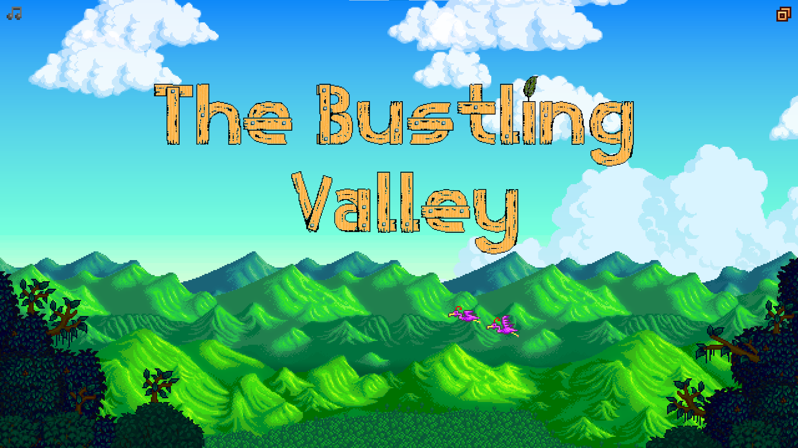
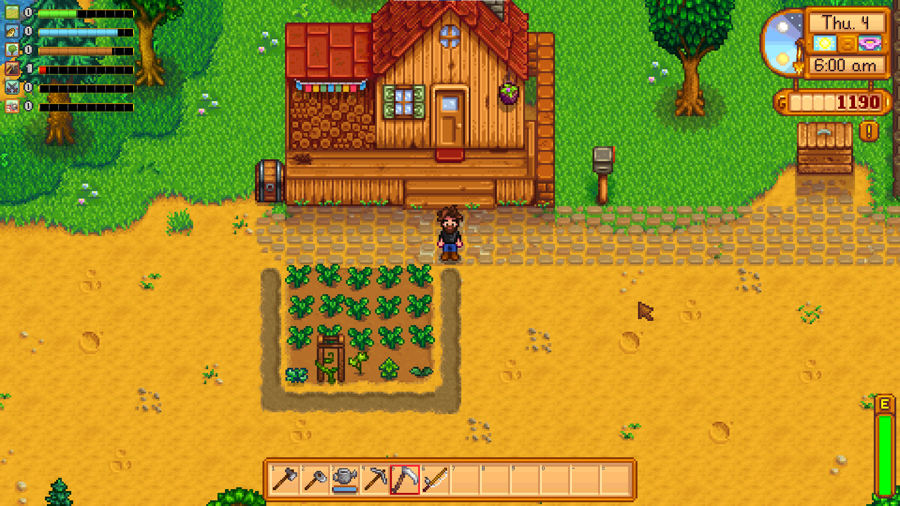
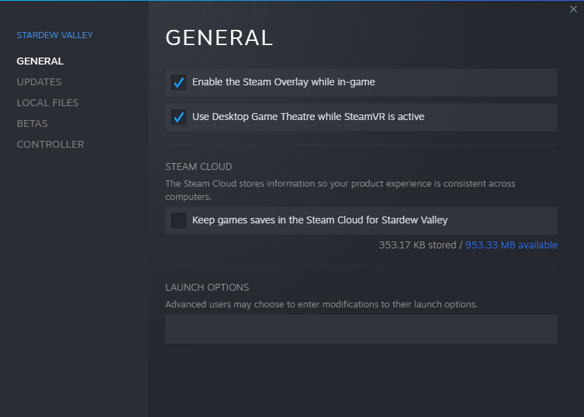
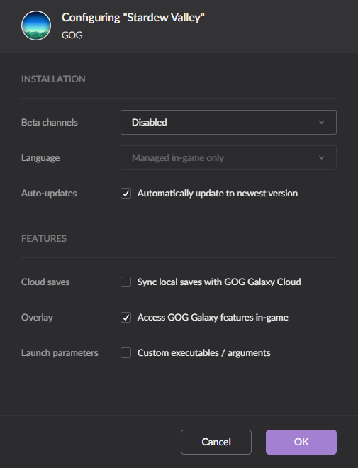
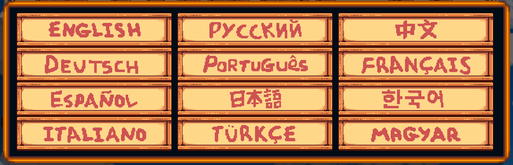
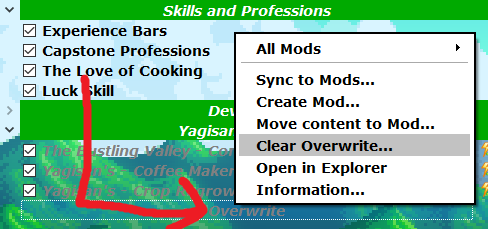

# The Bustling Valley

The Bustling Valley is a curated modlist designed for a bigger Stardew Valley experience. It includes new villages, new NPCs, and of course a farming expansion. **It is expected that players will not add additional mods or otherwise change this modlist.**

**You should NOT be installing this onto an already modded Stardew Valley. Remove existing installed mods before installing this mod list.**

  

- [The Bustling Valley](#the-bustling-valley)
- [Preamble](#preamble)
- [Quick Links](#quick-links)
- [Requirements](#requirements)
- [Installation](#installation)
  - [Pre-Installation](#pre-installation)
    - [Installing Microsoft Visual C++ Redistributable Package](#installing-microsoft-visual-c-redistributable-package)
    - [Installing Microsoft .NET 5.0 Runtime](#installing-microsoft-net-50-runtime)
    - [Installing SMAPI](#installing-smapi)
    - [Steam Config](#steam-config)
      - [Disable the Steam Cloud](#disable-the-steam-cloud)
    - [GoG Galaxy Config](#gog-galaxy-config)
      - [Disable the Gog Galaxy Cloud](#disable-the-gog-galaxy-cloud)
    - [Game Config](#game-config)
      - [Set the Game language to English](#set-the-game-language-to-english)
    - [Using Wabbajack](#using-wabbajack)
      - [Preparations](#preparations)
      - [Downloading and Installing](#downloading-and-installing)
        - [Automatic - Recommended](#automatic---recommended)
        - [Manual - Not Recommended](#manual---not-recommended)
      - [Problems with Wabbajack](#problems-with-wabbajack)
- [Starting the Game](#starting-the-game)
- [Choosing a Farm](#choosing-a-farm)
- [Updating](#updating)
- [Noteworthy Mods](#noteworthy-mods)
  - [Overhauls](#overhauls)
  - [Skills and Professions](#skills-and-professions)
  - [Automation](#automation)
  - [Gameplay](#gameplay)
- [Mod Default Hotkeys](#mod-default-hotkeys)
- [Other Post Installation FAQ](#other-post-installation-faq)
  - [Why is it slow to start?](#why-is-it-slow-to-start)
  - [Why does the game stutter between 6:00am and 6:10am?](#why-does-the-game-stutter-between-600am-and-610am)
  - [Stardew Valley just automatically updated, is it safe to run this list?](#stardew-valley-just-automatically-updated-is-it-safe-to-run-this-list)
  - [Does it work with a controller?](#does-it-work-with-a-controller)
  - [Does this work in multiplayer?](#does-this-work-in-multiplayer)
  - [Where is the Dwarf?](#where-is-the-dwarf)
  - [How do I use the WaterBot?](#how-do-i-use-the-waterbot)
  - [How do I remove the Modlist?](#how-do-i-remove-the-modlist)
  - [Should I update SMAPI?](#should-i-update-smapi)
  - [What is the JSON Shuffle? Can it be fixed?](#what-is-the-json-shuffle-can-it-be-fixed)
  - [How do I reset the configuration files?](#how-do-i-reset-the-configuration-files)
  - [Why are there trees in Ridgeside Village buildings?](#why-are-there-trees-in-ridgeside-village-buildings)
  - [Why can I walk off the right side road of the bus stop?](#why-can-i-walk-off-the-right-side-road-of-the-bus-stop)
  - [Why do farmhands only see a vanilla map?](#why-do-farmhands-only-see-a-vanilla-map)
  - [Contact and Technical Support](#contact-and-technical-support)

# Preamble

The Bustling Valley is a curated modlist designed for a bigger Stardew Valley experience. Designed for experienced players, it comes with 2 big expansions (Ridgeside Village and East Scarp), and several smaller expansions including new NPCS. With an enormous variety of new crops, new artisan goods, and new recipes, you'll find something new to specialise your farm in. **It is expected that players will not add additional mods or otherwise change this modlist.**

**You should NOT be installing this onto an already modded Stardew Valley. Remove existing installed mods before installing this mod list.**

Please be aware that this modlist may make perfection very hard or impossible to get.

# Quick Links

- [Patreon](https://patreon.com/yagisan) contains update posts and provides a way of showing support for the project.
- [Ko-fi](https://ko-fi.com/yagisan) contains update posts and provides a way of showing support for the project.
- [Downloads](https://github.com/Yagisan/The-Bustling-Valley/releases) for the most recent releases.
- [Wabbajack](https://github.com/wabbajack-tools/wabbajack/releases) for the tool to install this modlist.
- [Issues](https://github.com/Yagisan/The-Bustling-Valley/issues) for technical support with this mod list.
- [Changelog](CHANGELOG.md) for what's new.
- [Wabbajack Discord](https://discord.gg/wabbajack) chat about the list, and discover lists for other games.
- [Complete Modlist](MODLIST.md) a complete listing of everything included.

# Requirements

- The latest version of [Wabbajack](https://github.com/wabbajack-tools/wabbajack/releases)
- The latest version of [SMAPI](https://smapi.io/)
- A [Nexus Mods](https://www.nexusmods.com/) account.
- An up to date, unmodded, Stardew Valley installation.
  - **Acquired through either [GOG](https://www.gog.com/game/stardew_valley) or [Steam](https://store.steampowered.com/app/413150/Stardew_Valley/).**
- Around **2.5GB** of free space.
  - Around 550MB for Stardew Valley.
  - Around 650MB for the mod downloads.
  - Around 1GB for the mod list installation.

# Installation

**A final reminder. You should NOT be installing this onto an already modded Stardew Valley. Remove existing installed mods before installing this mod list.**

## Pre-Installation

These steps are only needed if you install this Modlist for the first time. If you update the Modlist, jump straight to [Updating](#updating).

### Installing Microsoft Visual C++ Redistributable Package

It is unlikely that you are missing this. However it is needed for MO2 and several plugins, so please download it and install it anyway from [Microsoft](https://support.microsoft.com/en-us/help/2977003/the-latest-supported-visual-c-downloads). Download the x64 version under "Visual Studio 2015, 2017 and 2019". This is a [Direct link](https://aka.ms/vs/16/release/vc_redist.x64.exe) if you can't find it.

### Installing Microsoft .NET 5.0 Runtime

As Stardew Valley 1.5.5 and later is now a 64 bit release, you must install the [Microsoft .NET 5.0 Desktop Runtime](https://dotnet.microsoft.com/download/dotnet/5.0/runtime) to play the game. Download the x64 version under "Run desktop apps". This is a [Direct link](https://download.visualstudio.microsoft.com/download/pr/1daf85dc-291b-4bb8-812e-a0df5cdb6701/85455a4a851347de26e2901e043b81e1/windowsdesktop-runtime-5.0.12-win-x64.exe) if you can't find it.

### Installing SMAPI

Stardew Valley mods depend on a special mod loader known as SMAPI. Go to the [SMAPI homepage](https://smapi.io/) and download the latest version so SMAPI to a temporary location. The recommended temporary folder is `C:\TEMP\SMAPI`. Extract the contents of SMAPI to that folder. There will be a batch file name `install on Windows.bat`. Run it and follow the prompts to install SMAPI. This same file can be used to uninstall SMAPI if needed.

**SMAPI updates regularly, and you should update it whenever you install or update this modlist.**

### Steam Config

#### Disable the Steam Cloud

Open the Properties window (right click the game in your Library -> Properties), navigate to the _General_ tab and un-tick the _Keep games saves in the Steam Cloud_.

### GoG Galaxy Config

#### Disable the Gog Galaxy Cloud

Open the Configure window (right click the game in Installed -> Manage installation -> Configure), navigate to _Features_ and un-tick _Sync local saves with the GOG Galaxy Cloud_.

### Game Config

#### Set the Game language to English

This modlist is in English, and most of the mods you find are in English. **I can not give support to people with a non-English game**.

Start the game using the game shortcut or Steam / GoG Galaxy launcher. Find the language options icon on the main menu.

From the menu that appears, select English, the exit the game via the main menu.

### Using Wabbajack

#### Preparations

Grab the latest release of Wabbajack from [here](https://github.com/wabbajack-tools/wabbajack/releases) and place the `Wabbajack.exe` file in a _working folder_.  The recommended working folder is `C:\WJ\WabbaJack`. This folder **must not** be in a _common folders_ like your Desktop, Downloads or Program Files folder. Do not install to a *OneDrive* folder.

#### Downloading and Installing

The download and installation process can take a very long time depending on your system specs. Wabbajack will calculate the amount of threads it will use at the start of the installation. To have the highest amount of threads and thus the fastest speed, it is advised to have the working folder on an SSD.

##### Automatic - Recommended

1. Open Wabbajack.
2. Click on **Browse Modlists**. Under Games, select Stardew Valley. Select The Bustling Valley from the selection.
3. Set the _installation location_. The recommended installation location is `C:\WJ\TBV`.  This folder **must not** be in a _common folders_ like your Desktop, Downloads or Program Files folder. **The rest of this document will assume you are using the recommended installation path.** Do not install to a *OneDrive* folder.
4. Set the _download location_. The recommended download location is `C:\WJ\TBV_downloads`.  This folder **must not** be in a _common folders_ like your Desktop, Downloads or Program Files folder. Do not install to a *OneDrive* folder.
5. Check **Overwrite Installation**
6. Click the Go/Begin button
7. Wait for Wabbajack to finish
8. If you run into any issues see the next section. If the installation is successful, proceed to [Post-Installation](#post-installation).

##### Manual - Not Recommended

1. [Download the latest release from GitHub](https://github.com/Yagisan/The-Bustling-Valley/releases). It will be named `The.Bustling.Valley.wabbajack
` Save it to a temporary folder. The recommended temporary folder is `C:\Temp\Valley`.
2. Open Wabbajack.
3. Click on **Install from Disk**. Set the target modlist to `C:\Temp\Valley\The Bustling Valley.wabbajack`
4. Set the _installation location_. The recommended installation location is `C:\WJ\TBV`.  This folder **must not** be in a _common folders_ like your Desktop, Downloads or Program Files folder. **The rest of this document will assume you are using the recommended installation path.** Do not install to a *OneDrive* folder.
5. Set the _download location_. The recommended download location is `C:\WJ\TBV_downloads`.  This folder **must not** be in a _common folders_ like your Desktop, Downloads or Program Files folder. Do not install to a *OneDrive* folder.
6. Check **Overwrite Installation**
7. Click the Go/Begin button
8. Wait for Wabbajack to finish
9. If you run into any issues see the next section. If the installation is successful, proceed to [Post-Installation](#post-installation).

#### Problems with Wabbajack

There are a lot of different scenarios where Wabbajack will produce an error. I recommend re-running Wabbajack before posting anything. Wabbajack will continue where it left off so you will not lose progress.

**Could not download x**:

If a mod updated and the old files were deleted, it is impossible to download them. You will need to be patent and wait for me to update the modlist.

**Wabbajack could not find my game folder**:

Wabbajack will not work with a pirated version of the game. If you own the game on Steam or GoG, go back to the [Pre-Installation](#pre-installation) step.

# Starting the Game

Head over to the installation folder and locate an executable named `ModOrganizer.exe` and launch it. This will be `C:\WJ\TBV\ModOrganizer.exe` if you have followed the recommended settings. Once it is launched, there will be a dropdown box on the top right and a big run button right next to it. Ensure it is set to SMAPI by selecting it in the dropdown box and then hitting the run button. You have to run SMAPI through Mod Organizer 2 in order to play The Bustling Valley.

# Choosing a Farm

This mod list should work with any farm, however they not all been extensively tested.

# Updating

If this Modlist receives an update please check the [Changelog](CHANGELOG.md) before doing anything. The [Changelog](CHANGELOG.md) will advise if you will need to start a new game, or if your existing saves will continue working.

**Wabbajack will delete all files that are not part of the Modlist when updating!**

This means that any additional mods you have installed on top of the Modlist will be deleted. Your downloads folder will not be touched.

Updating is like installing. You only have to make sure that you select the same path and tick the _overwrite existing Modlist_ button.

# Noteworthy Mods

## Overhauls

**[Ridgeside Village](https://www.nexusmods.com/stardewvalley/mods/7286)** is a huge expansion with over 50 new NPCs, a new village to the east of Pelican town, new quests and more.

**[Boarding House and Bus Stop Extension](https://www.nexusmods.com/stardewvalley/mods/4120)** adds a boarding house behind the bus stop with several new NPCs. NPCs from other mods can make their homes here.

**[East Scarp](https://www.nexusmods.com/stardewvalley/mods/5787)** adds a village to the west of Pelican town, and several new NPCs. NPCs from other mods can make their homes here.

**[Lunna - Astray in Stardew Valley](https://www.nexusmods.com/stardewvalley/mods/6626)** adds a new village, a special quest, new crops, fish and more.

## Skills and Professions

**[Capstone Professions](https://www.nexusmods.com/stardewvalley/mods/7636)** adds a final choice of professions once you max out all your skills.

## Automation

**[Automate](https://www.nexusmods.com/stardewvalley/mods/1063)** by placing a chest next to a machine (like a furnace or crystalarium), the machine will automatically pull raw items from the chest and push processed items into it. Connect multiple machines with a chest to link them.

**[Water Bot](https://www.nexusmods.com/stardewvalley/mods/8167)** by right-clicking with your watering can your farmer will go crop by crop watering them, expending the same amount of time and energy as if you had done it yourself to keep as vanilla as possible, but a lot less tedious!

**[Eidee Easy Fishing](https://www.nexusmods.com/stardewvalley/mods/4806)** reduces the tediousness of fishing by automatically catching the fish for you. If you get a bite, and hook the fish, Eidee Easy Fishing will catch the fish. It is **not** an instant catch, nor will it automatically hook for you. Better rods, bait and tackle will improve catch speed and rates.

**[Better Junimos](https://www.nexusmods.com/stardewvalley/mods/2221)** significantly improves Junimos: automatically plant crops, fertilize, work for a fee, increase range, and more!

**[Better Junimos Forestry](https://www.nexusmods.com/stardewvalley/mods/8992)** adds new skills to the Junimos. They can hoe your fields, grow wild trees for timber, look after your fruit trees, clear debris, and mow the lawn.

## Gameplay

**[Multiple Mini-Obelisks](https://www.nexusmods.com/stardewvalley/mods/7900)** allows you to place more than 2 mini-obelisks, including outside the farm.

**[Horse Overhaul](https://www.nexusmods.com/stardewvalley/mods/7911)** makes the horse the way it should be, thin, fast and useful.

**[Better Ranching](https://www.nexusmods.com/stardewvalley/mods/859)** prevents failing milking/shearing attempts and adds an indicator when animals can be petted, milked, or sheared.

**[Watering Grants Experience And Crops Can Wither](https://www.nexusmods.com/stardewvalley/mods/7768)** does exactly what it says. Manual watering grants some farming experience, and if not watered, your crops will die.

# Mod Default Hotkeys

- [Automate](https://www.nexusmods.com/stardewvalley/mods/1063)
  - **U** Toggles the automation overlay.
- [Chests Anywhere](https://www.nexusmods.com/stardewvalley/mods/518)
  - **B** Access all chests in the current world area.
- [Lookup Anything](https://www.nexusmods.com/stardewvalley/mods/541)
  - **F1** Show live information about the object under the cursor.
- [Data Layers](https://www.nexusmods.com/stardewvalley/mods/1691)
  - **F2** Toggle data layers.
- [To-Dew](https://www.nexusmods.com/stardewvalley/mods/7409)
  - **L** Access the TO-DEW list.
- [Horse Overhaul](https://www.nexusmods.com/stardewvalley/mods/7911)
  - **H** Access horse information.
  - **P** Access pet information.
- [Event Lookup](https://www.nexusmods.com/stardewvalley/mods/8505)
  - **N** List all heart events that can be triggered today.

# Other Post Installation FAQ

## Why is it slow to start?

The Bustling Valley can take up to 10 minutes or so to start. While it may look like it has hung, it is still loading. The primary cause of the slowdown is a mod called [PyTK](https://www.nexusmods.com/stardewvalley/mods/1726). This is used by many mods to load new maps, and is unfortunately not completely compatible with Stardew Valley 1.5.X, resulting in slow load times.

Additionally, [Json Assets](https://www.nexusmods.com/stardewvalley/mods/1720) also slows down the start time of the game (although not to the extent PyTK does). The length of start up depends on how many JSON assets need to be loaded. Bigger mods, have many, many more assets than smaller mods. It doesn't affect runtime performance though.

## Why does the game stutter between 6:00am and 6:10am?

Every day between 6:00am and 6:10am the game spawns in many objects. On some systems, this produces a noticeable lag or stutter when this occurs.

## Stardew Valley just automatically updated, is it safe to run this list?

Generally yes. The first time you load SMAPI will detect that the game has updated. It will need to restart. You should still check for a SMAPI update at [https://smapi.io/](https://smapi.io/) just in case.

## Does it work with a controller?

Several mods seem to behave erratically or not at all with a controller, so the official position is, **No**, it does not.

## Does this work in multiplayer?

Generally speaking this should work in multiplayer via the Internet, LAN, or local split screen mode. As with the unmodded game, some events may need to be triggered by the host, and/or each farmhand individually.

Please note that multiplayer primarily relies on community testing and bug reporting.

## Where is the Dwarf?

Please follow Professor Jaspers questline until the 6 heart stage.

## How do I use the WaterBot?

To use the WaterBot, select the watering can, then **right click** on a crop. Your farmer will automatically travel to, and water every crop they can reach. The will refill the watering can as needed, from the closest water source, and will stop when either all crops are watered, or the farmer is out of energy.

**WaterBot is not designed for a controller, and may behave erratically, or not at all if used with one.**

## How do I remove the Modlist?

Simply delete the installation folder (`C:\WJ\TBV` if you have been following this guide) and that will remove it, but why would you want to?

## Should I update SMAPI?

In addition to being a mod loader, SMAPI also contains fixes and runtime updates to help make mods work with different versions of Stardew Valley. If you are having problems it is a good idea to update to the [latest version of SMAPI](#installing-smapi) and try again.

## What is the JSON Shuffle? Can it be fixed?

This is described [in depth here](https://stardewmodding.wiki/wiki/Json_Shuffle), but the short version is that adding, removing, or updating mods that use JSON assets in an ongoing save results in the items becoming messed up. **To avoid a JSON Shuffle, please wait until all machines have finished processing before updating this mod list**.

It's not fixable. Please don't alter this modlist once you start playing. **If you do get a shuffle, the best thing to do is to put all shuffled items in the shipping bin, or trash it.**

## How do I reset the configuration files?

Sometimes configuration files need to be reset. This is sometimes needed after the modlist is updated. Resetting the configuration files is very easy to do. Scroll to the very bottom of the mod list. There is a menu item named Overwrite.

**Right click** on it, and select **Clear Overwrite**. That's it. The game will regenerate any needed configuration files when you next start.

## Why are there trees in Ridgeside Village buildings?

The Bustling Valley 0.2.0+ includes Ridgeside Village 2.0 - this is a complete overhaul of the previous versions. The maps have changed. As a result you **must** start a new farm for the maps to look correct. You can not continue with your existing save.

## Why can I walk off the right side road of the bus stop?

The updated Bus Stop map was made to allow access to an NPC that is not included in this mod list. That NPC is accessed via the right side road. The original better bus stop map had an oversight from Ridgeside Village. When Pam returns from the desert, she drove through grass and fences. As of Ridgeside Village 2.0.3 this map is included as-is from Ridgeside Village.

## Why do farmhands only see a vanilla map?

There is a limitation in SMAPI's content API which makes it difficult for recolors or expansion mods to correctly update the map for farmhands in multiplayer. There's a planned change in the upcoming SMAPI 4.0.0 to address that.

## Contact and Technical Support

Please check the [Issues](https://github.com/Yagisan/The-Bustling-Valley/issues) (open **and** closed ones) on GitHub first if you have any problems. The same goes for _Enhancements_ or _Feature/Mod Requests_. If you believe you have found a bug, please file bug report [here](https://github.com/Yagisan/The-Bustling-Valley/issues) with as much information as possible to replicate the issue. Requests for support on any other platform will be ignored. 

**ALL BUG REPORTS REQUIRE A FULL SMAPI LOG**

Please upload your SMAPI log to [https://smapi.io/log](https://smapi.io/log) (see instructions on that page) and share the link with your bug report.

**DO NOT DM ME ON DISCORD. I WILL NOT PROVIDE SUPPORT FOR YOU IN DMS AND I WILL BLOCK YOU**.
